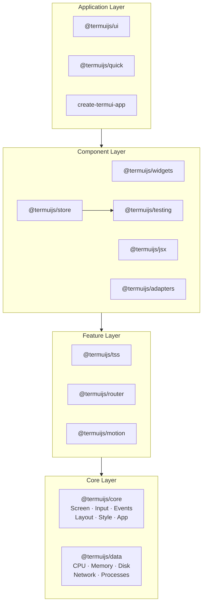

# Architecture

TermUI is a monorepo with 15 packages. Each one does one thing and can be used on its own or combined with the others.

Dependencies flow downward; nothing in the core layer imports from the layers above it.

## Package dependency graph

Four layers, each building on the one below:

## Render pipeline

Every frame follows this path:

### Layout

The layout engine computes positions and sizes using a flexbox algorithm. It handles `flexDirection`, `flexGrow`, `padding`, `margin`, `gap`, and alignment.

All computed values are rounded to integers since terminal cells are discrete.

### Style resolution

TSS variables and selectors are resolved. The theme engine substitutes `var(--name)` references and matches selectors against widget types and pseudo-classes like `:focus`.

### Buffer diff

The screen holds two buffers. The renderer diffs them cell by cell and only writes changed cells to stdout.

A full-screen update that touches 3 cells writes exactly 3 escape sequences.

## Event flow

`InputParser` decodes raw bytes into `KeyEvent` objects with key name, modifiers, and raw bytes. Events bubble from the focused widget up through its parents to the app level.

## Focus system
The focus system lives between `@termuijs/jsx` and `@termuijs/ui`. It provides a `FocusContext` that propagates the currently-focused widget ID down the tree via four hooks: `useFocusManager` (owns state), `useFocus` (reads/sets per widget), `useFocusTrap` (Tab capture for modals), and `useKeyboardNavigation` (arrow-key list navigation). See [Focus Management](/docs/jsx/focus) for details.

## State management

Three levels of state, each suited to different situations:

| Level           | API             | Good for                                                        |
| --------------- | --------------- | --------------------------------------------------------------- |
| Local           | `useState`      | State inside one component (cursor position, open/closed)       |
| Shared config   | `createContext` | Data that rarely changes and many components need (theme, user) |
| Global reactive | `createStore`   | Data that updates often and multiple components select from     |

## Dev server

The dev server runs your entry file in a child process via `Bun.spawn`. When a source file changes, it kills the old process and spawns a fresh one.

Clean slate on every reload, no stale module cache.

